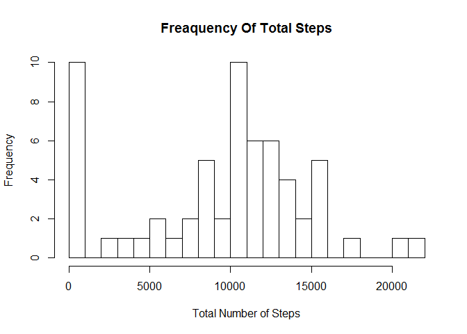
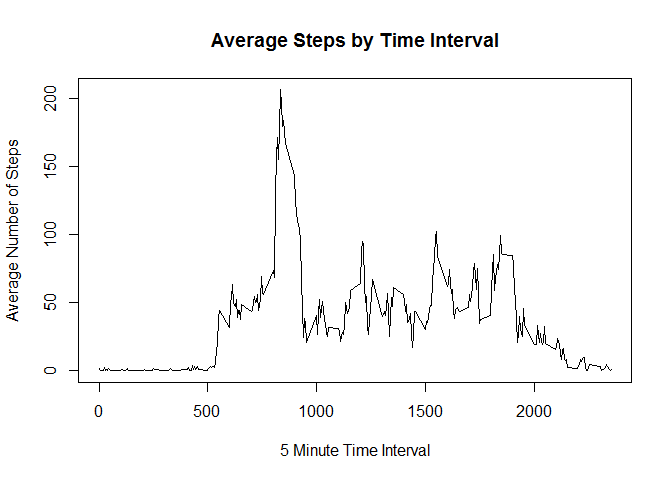
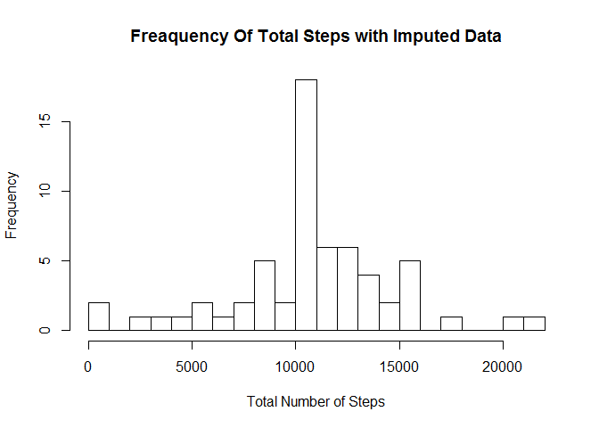
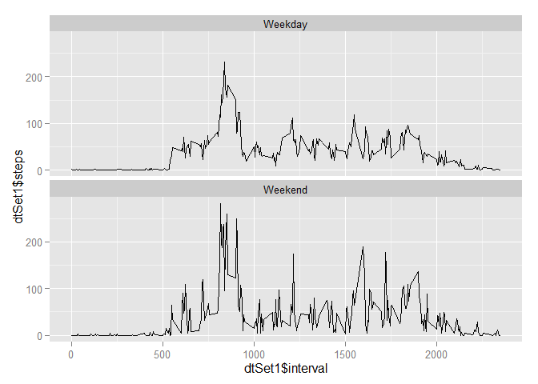

# Reproducible Research: Peer Assessment 1


## Loading and preprocessing the data

```r
if (!file.exists('activity.csv')) 
  { 
       unzip('activity.zip')
  }
dtSet <- read.csv('activity.csv',na.strings = "NA")
dtSetWithoutNA <- dtSet[!is.na(dtSet$steps),]
```
## What is mean total number of steps taken per day?

```r
library(plyr)
dtActivity_DateGrp <- ddply(dtSet, .(date), summarise,sum_steps = sum(steps, na.rm = TRUE))
hist(dtActivity_DateGrp$sum_steps,breaks=20,xlab = 'Total Number of Steps',main = 'Freaquency Of Total Steps')
```

 

```r
mean_total_steps_per_day = mean(dtActivity_DateGrp$sum_steps)
median_total_steps_per_day = median(dtActivity_DateGrp$sum_steps)
```
Mean total steps per day is: 9354.2295082  
Median total steps per day is: 10395  

## What is the average daily activity pattern?

```r
dtActivity_IntervalGrp <- ddply(dtSet, .(interval), summarise,sum_steps = mean(steps, na.rm = TRUE))
plot(y=dtActivity_IntervalGrp$sum_steps,
     x=dtActivity_IntervalGrp$interval,
     type="l",
     main = 'Average Steps by Time Interval',
     xlab = '5 Minute Time Interval',
     ylab = 'Average Number of Steps')
```

 

  
## Imputing missing values

```r
missingValPercent = mean(is.na(dtSet$steps))*100
interval_with_Max_Steps <- dtActivity_IntervalGrp$interval[which.max(dtActivity_IntervalGrp$sum_steps)]
missingValcount = sum(is.na(dtSet$steps))

ImputedDtSet <- ddply(dtSet,.(interval),  function(x){
  #calculate average steps for given interval
                  avgSteps = mean(x$steps,na.rm = TRUE)
                  avgSteps <- as.integer(avgSteps)
                  x$steps[which(is.na(x$steps))] <- avgSteps
                  x
} )

dtActivityImputed_DateGrp <- ddply(ImputedDtSet, .(date), summarise,sum_steps = sum(steps, na.rm = TRUE))

mean_total_steps_per_day_imputed = mean(dtActivityImputed_DateGrp$sum_steps)
mean_total_steps_per_day_imputed <- as.integer(mean_total_steps_per_day_imputed)
median_total_steps_per_day_imputed = median(dtActivityImputed_DateGrp$sum_steps)
hist(dtActivityImputed_DateGrp$sum_steps,breaks=20,xlab = 'Total Number of Steps',main = 'Freaquency Of Total Steps with Imputed Data')
```

 
   
Interval with Max no of Average Steps: 835  
Count Of Missing Values: 2304  
Percentage Of Missing Values: 13.1147541  
Mean total steps per day with imputed data is: 10749  
Median total steps per day with imputed data is: 10641

## Are there differences in activity patterns between weekdays and weekends?

```r
dtSet$dateP <- as.POSIXlt(dtActivity_DateGrp$date,format="%Y-%m-%d")
dtSet$day <- "Weekday"
dtSet$day [weekdays(dtSet$dateP) %in% c("Saturday","Sunday")] <- "Weekend"

dtSet1 <- aggregate(dtSet[1],
                                   by=dtSet[c(3,5)],
                                   FUN=mean,
                                   na.rm=TRUE)
library(ggplot2)
plot <- ggplot(data = dtSet1, aes(x=dtSet1$interval,y=dtSet1$steps))
plot + geom_line() + facet_wrap(~day,nrow=2)
```

 
